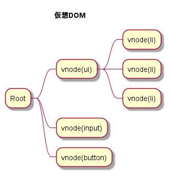
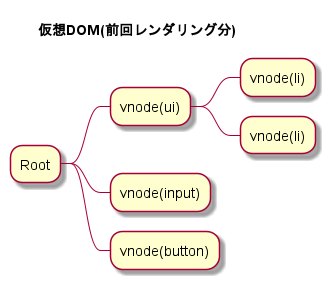
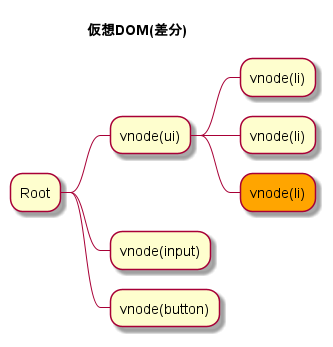
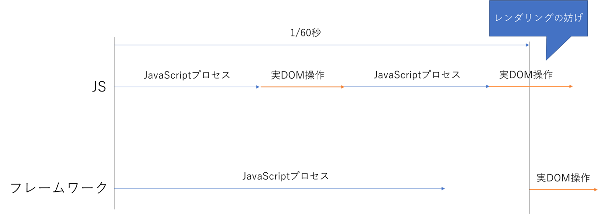
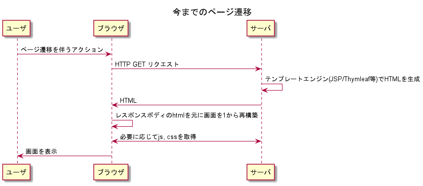
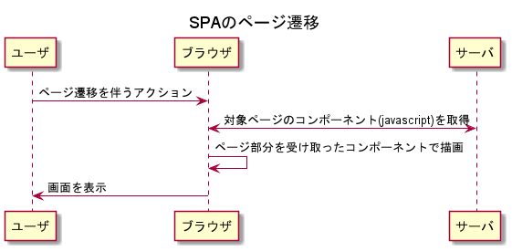

プロジェクトにてVueを導入する機会があったので、メンバーにJavaScriptフレームワークがどんなものか知ってもらうために作成しました  
詳しい使い方の説明はしません  

(marpでパワポにするため資料をちょっと書き換えただけなので構成がわかりにくいかも)

## まず、なぜJQueryを使わなくなってきたのか？

- JQueryはIE, firefox, safari, chrome等のブラウザ間の差異を吸収する役割が大きかった
- 現在、ECMAがJavaScriptを標準化しており、ブラウザ間の差異はなくなりつつある

- DOMの操作性(?)は各種JSフレームワークのほうが圧倒的に高い
- 速度面でもJSフレームワークのほうが早いと言われる

### -> 新規プロジェクトでのjQuery採用率は下がっている

# JSフレームワークとは  

JSフレームワーク(主にReact, Vue)の主な機能である以下について説明します

- 宣言的なUIの構築
- 仮想DOM (Virtual DOM)
    実DOMへの反映を最小限にすることで高速化
- コンポーネントシステム
    ボタンやカレンダーといった部品単位でコードを分けることができる

# 宣言的なUIの構築

### 命令的(宣言的の対義語)
- 何をするかを記述する

### 宣言的
- どういう状態になるべきかを記述する

## TODOリストの例


### JavaScriptのみの場合(命令的)

```html
  <!-- html -->
  <ul id="todos"></ul>
  <input type="text" id="text">
  <button id="addTodo">add todo</button>
```

```js
// js
document.addEventListener("DOMContentLoaded", () => {
    const btn = document.querySelector("#addTodo")
    btn.addEventListener("click", () => {
        const value = document.querySelector("#text").value
        const li = document.createElement("li")
        li.textContent = value
        document.querySelector("#todos").appendChild(li)
        document.querySelector("#text").value = ""
    })
})
```

クリックされたら、テキストから値を取って、`li`要素を新しく作って、そこにテキストの値を入れて…

### Vueの場合(宣言的)
`template`に最終的なUIがどうあるべきかを宣言する
```html
<template>
  <ul>
    <li v-for="todo in todos" :key="todo">{{todo}}</li>
  </ul>
  <input type="text" v-model="text">
  <button @click="addTodo">add todo</button>
</template>
<script>
export default {
    data : () => ({
        text: "", // UI上で扱うデータの定義
        todos: []
    }),
    methods: {
        addTodo() {
            this.todos.push(this.text) // 本質的なコードに集中できる
            this.text = ""
        }
    }
}
</script>
``` 

Reactの場合も同じ
```jsx
const App = () => {

    const [todos, setTodos] = useState([]) // UI上で扱うデータの定義
    const textRef = useRef(null)

    const addTodo = () => {
        setTodos([...todos, textRef.current.value]) // 本質的なコード
        textRef.current.value = ""
    }

    return (
        <>
            <ul>
                {todos.map(todo => (
                    <li>{todo}</li>
                ))}
            </ul>
            <input type="text" ref={textRef}>
            <button onClick={addTodo}>add todo</botton>
        </>
    )
}
```

# 仮想DOM

> ## 仮想DOMとは？
> 仮想 DOM (virtual DOM; VDOM) は、インメモリに保持された想像上のまたは「仮想の」UI 表現が、ReactDOM のようなライブラリによって「実際の」DOM と同期されるというプログラミング上の概念です。このプロセスは差分検出処理 (reconciliation)と呼ばれます。

## つまり？

さっきのVueでいうと、以下のDOMはそのままHTMLに現れるわけではなく…

```html
<template>
  <ul>
    <li v-for="todo in todos" :key="todo">{{todo}}</li>
  </ul>
  <input type="text" v-model="text">
  <button @click="addTodo">add todo</button>
</template>
```

- 現在の状態に基づいて仮想DOMツリーを生成する
- 前回レンダリングとの差分を検出する



- 検出された差分のみリアルDOMに反映する



## これがパフォーマンス向上につながるのか？

- 仮想DOMだから早い！という説明がよくあるが、これはほぼ間違い
- 仮想DOMは宣言的UIを実現するためのもの
    - 宣言的UIを実現するには、状態が変化するたびDOMツリーを再構築する必要がある
    - リアルDOMツリーを再構築するのはあまりにもパフォーマンスが悪い
    - 仮想DOMを再構築し、差分だけリアルDOMに反映することで宣言的UIをパフォーマンスを落とさず実現している

- 宣言的UIは仮想DOMを使わないとめちゃくちゃ重いが真実？

## じゃあなんで早いのか？そもそも早いのか

多少早い？

- JSフレームワークは状態の変更に伴うUIの変更を、バッチ処理している
- ブラウザは1秒あたり60回画面を描画している(端末のスペックにもよる)
- つまり、1/60秒以上かかる処理は画面のレンダリングを妨げる
- JavaScriptで時間のかかる処理はDOMを触る処理
- JSフレームワークは、各種イベントに伴う処理を終えた後、次の描画フレームまで待機し、その描画フレームの最初にDOM操作を行うため、レンダリングを妨げにくい
- 上記含めた細々としたフォーマンスチューニングにより、JavaScriptで下手に動かすよりも早くなるケースはある




# コンポーネントシステム
今までも(DHTMLX等の)コンポーネントを使って開発してきたので説明は軽め

- ボタンやカレンダーといった部品単位でコードを分けることができる
- コンポーネントを再利用することで、生産性が高くなる
- プラグインを使えば、各ページもコンポーネントとして扱い疑似的な画面遷移が可能

## 疑似的な画面遷移

- ライブラリは`vue-router`, `react-router-dom`が有名
- これらを使ったアプリケーションは、1つのHTMLで全ページを表示するので、Single Page Application(SPA)と呼ばれる


- ページ遷移のたび、HTMLの解析、必要な静的ファイルの取得が行われる


- 1から画面を再構築しないため、ページ遷移の速度が早い


以上
