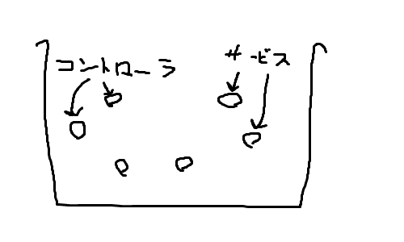

SpringでREST APIを作成する方法について、Springを利用するプロジェクトに参画する方に最低限の知識を得てもらうために作成しました。  


## 対象
- Spring(Boot)初学者

## Webアプリケーションの種類について
Webアプリケーションの種類は大まかに分けて2つあります

- MPA(Multiple Page Application)  
    HTTPリクエストに応じて毎回HTMLを構築しブラウザに返す
- SPA(Single Page Application)  
    初回リクエスト時にHTMLを返す
    以降の通信はREST APIを使ったJSONのやり取りのみ


## MPA, SPAの比較

### MPA
- ページが切り替わるたびに1から画面を構築しなおしている
- 代表的なサービス: ニュースサイトやAmazonなどのECサイトはMPAが多いです  
    (少し前まで、SPAは検索エンジンに引っ掛かりにくかった)

### SPA
- ページが切り替わる場合、必要なデータだけサーバから取得し、画面を更新する
- 代表的なサービス: Twitter, Facebook等

## REST APIとは

最近はSPAで画面を構築する機会が増えており、その際のデータのやり取りに用いられるのがREST APIです。  
簡単に説明すると、htmlの代わりにJSONを返すAPIのことを指します。

# Springの基本 (ざっくり)
## DIとDIコンテナについて

### ApplicationContext(DIコンテナ)
- Beanを入れる容器

### Bean
- Springが扱う部品


- BeanはBean同士で依存関係をもつ

```java
class HogeBean {

    AnotherBean anotherBean;

    void hoge () {
        anotherBean.doSomething();
    }
}
```


## DI(Dependency Injection)

- 直訳すると依存性の注入
- あるBeanが必要とするほかのBeanへの参照をアプリケーションコンテキストからとってきて注入する


```java
class HogeBean {

    AnotherBean anotherBean; // <- インスタンスを外部から注入

    void hoge () {
        anotherBean.doSomething();
    }
}
```


## 実装方法

```java
// どうやってこのクラスをBeanとしてApplicationContextに登録するのか？🤔
class HogeBean {

    AnotherBean anotherBean; // <-どうやってこいつをDIするのか？🤔

    void hoge () {
        anotherBean.doSomething();
    }
}
```


- `@Component`を付けると自動でアプリケーションコンテキストにBeanとして登録される※他にも登録するためのアノテーションがいくつかある（後述）
- `@Autowired`をつけると、自動でアプリケーションコンテキスト内にあるBeanをフィールドに突っ込んでくれる(DI)

```java
@Component
class HogeBean {

    @Autowired
    AnotherBean anotherBean;

    void hoge () {
        anotherBean.doSomething();
    }
}
```

# Springの動作概念について


- 開発者が最低限作る必要があるのはコントローラとサービス(とDAO)
- コントローラとサービス(とDAO)もBeanの1つ



## コントローラの定義方法

- `@RestController`を付けるとSpringにコントローラと認識されつつ、Beanとして登録される
- `@GetMapping`等のアノテーションを付けるとHTTPリクエストとマッピング(=紐づけされる)
    以下の例だとURLが/api/sampleでHTTPメソッドがGETのリクエストに紐づけられる

```java
@RestController
public class SampleController {

    @Autowired
    SampleService sampleService; // 呼び出したいサービスをDI

    @GetMapping("/api/sample")
    public void sample() {
        sampleService.doBusinessLogic();
    }
}
```

## サービスの定義方法
- `@Service`を付けるとBeanとして登録される
- 必要に応じてDAOや別サービスをDIする

```java
@Service
public class SampleService {

    @Autowired
    SampleDao dao;

    @Autowired
    AnotherService anotherService;

    public void doBusinessLogic() {
        System.out.pringln("業務ロジック");
    }
}
```


## HTTPリクエストの受け取り方

## GETリクエスト


### 以下のリクエストを想定
```
GET /fuga?filename=houkoku&priority=1 HTTP/1.1
Host: hoge.jp
```


### SpringでHTTP GETリクエストからパラメータを取り出すには
- `@RequestParam`を引数につける

```java
@GetMapping("/document")
public void sample(
    @RequestParam(name = "filename") String filename,
    @RequestParam(name = "priority") Integer priority // 型も良しなに変えてくれる
) {
    System.out.println(filename); // -> houkoku
    System.out.println(priority); // -> 1
}
```


### もしくはデータクラス(DTO)を引数に指定するといい感じに当てはめてくれる

```java
class DocumentParams {
    String filename; // フィールド名=パラメータ名にする
    Integer priority;
}
```

```java
@GetMapping("/document")
public void sample(DocumentParams params) {
    System.out.println(params.filename); // -> houkoku
    System.out.println(params.priority); // -> 1
}
```

こっち推奨です


## POSTリクエスト

## 以下のリクエストを想定
```
POST /fuga HTTP/1.1
Host: hoge.jp
User-Agent: Mozilla/5.0 (Windows NT 10.0~略
Content-Type: application/json; charset=utf-8

{
    "filename": "作業日報",
    "priority": 1,
    "tags": ["report"]
    "content": {
        "title": "20XX年XX月XX日 山田太郎",
        "body": "今日は何もありませんでした"
    }
}
```

### SpringでPOSTリクエストのデータを受け取るには

```java
// JSONと同じ形式のJavaクラスを定義する
class DocumentParam {
    String filename;
    Integer priority;
    List<String> tags;
    Content content; // ネストしているものは別クラスで定義する
}
class Content {
    String title;
    String body;
}
```

```java
@PostMapping("/document")
void post (@RequestBody DocumentParam param) {
    System.out.println(params.filename); // -> 作業日報
    System.out.println(params.priority); // -> 1
    System.out.println(params.tags.get(0)); // -> report
    System.out.println(params.content.title); // -> 20XX年XX月XX日 山田太郎
}
```


## HTTPレスポンス

- コントローラのメソッドに戻り値を定義し、`@ResponseBody`アノテーションを付ける
```java
class Content {
    String title;
    String body;
}
```
```java
@GetMapping("/content")
@ResponseBody
Content get () {
    Content content = new Content();
    content.title = "吾輩は猫である";
    content.body = "名前はまだない";
    return content;
}
```


- 実際に返却されるレスポンス
```
HTTP/1.1 200 OK
Content-Type: application/json

{
    "title": "吾輩は猫である",
    "body": "名前はまだない"
}
```
