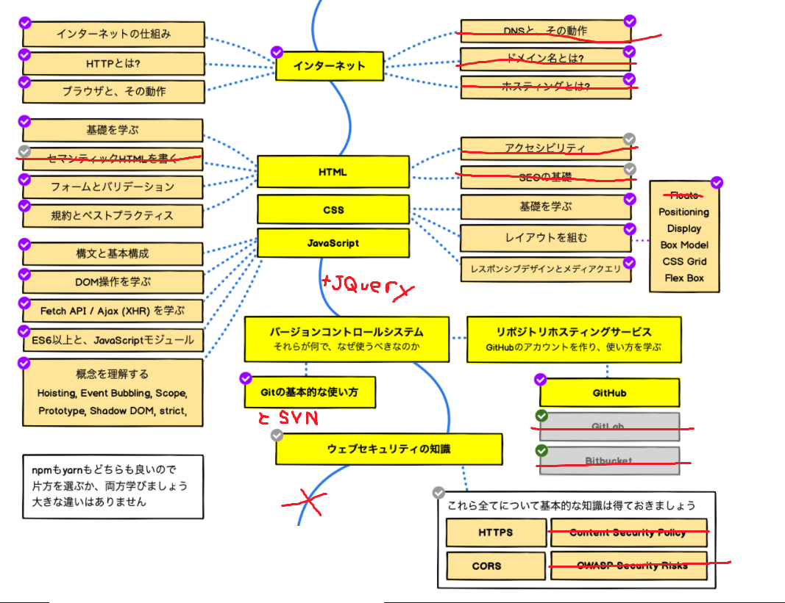
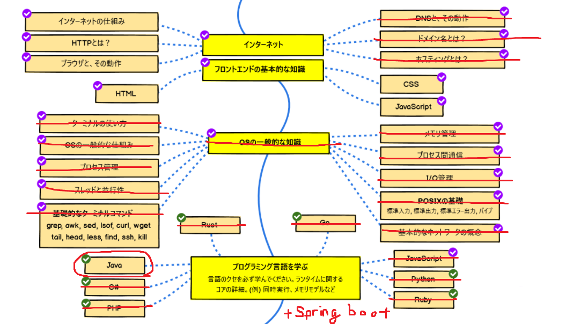
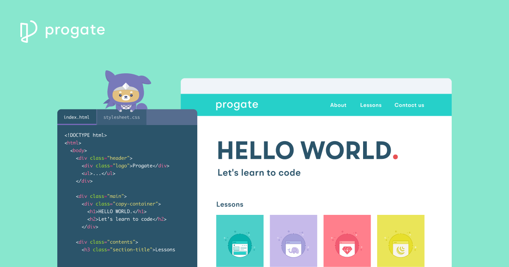
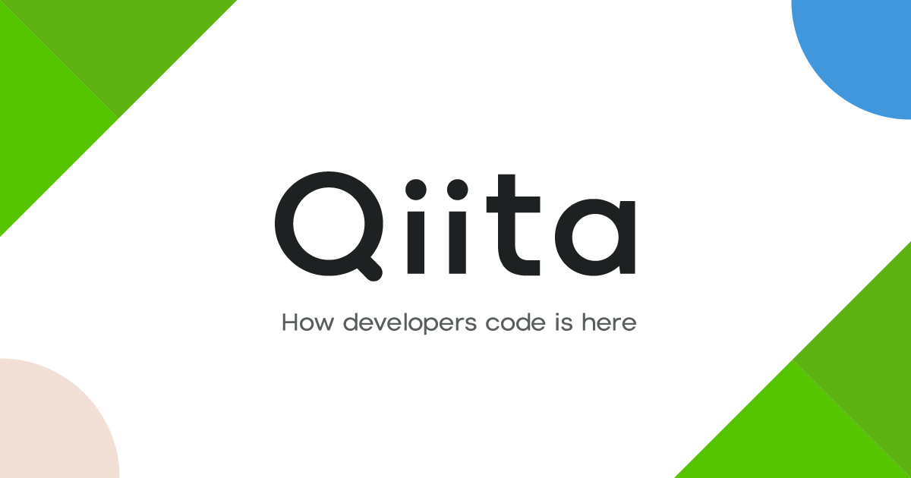
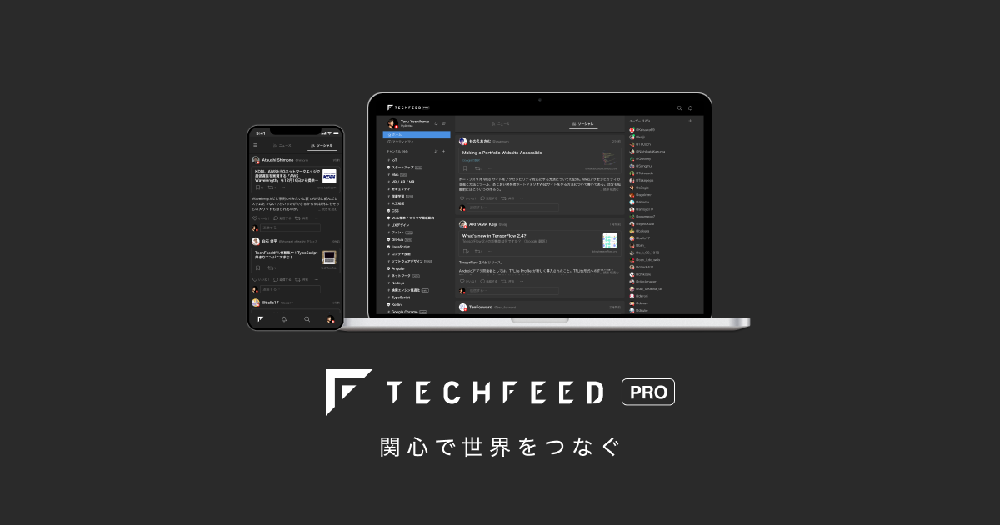

toBのWebシステム開発を行う受託開発orSES会社に入社した新人の方向けに、新人研修後にどのように学習を進めていくべきか、簡単な指標を示してみる。  
といっても今いる組織にフォーカスしたものなので、言語としてはJava、JavaScriptを、ライブラリ、フレームワークはSpring、JQueryを利用する前提です。

## 背景
- 社員教育はOJTが主となっている
- OJTでは配属されたプロジェクトの、割り振られた作業で必要な知識しか習得できない
- 特に改修案件で業務ロジックをちょっといじるだけだと何も得られない

## 目的
- OJTでの技術面の成長には限界があり、できれば個々で学習し続けてほしい
- 何を勉強すればいいかを判断する指標になればと思っています

# ロードマップ（行程表）を把握する

一流？のエンジニアになるために何を学んでいけばよいかをロードマップの図にしてくれている人がいるので、参考のため紹介します。

https://github.com/kamranahmedse/developer-roadmap/tree/master/translations/japanese

## 多すぎ

- あくまでフロントエンド、バックエンド、DevOpsそれぞれの専門家になるためのロードマップ
- 実際に覚えるべき知識はもっと少ない
- 大体のtoB開発ではフロントエンド、バックエンドで分業していないため、フロントエンド、バックエンドのロードマップをある程度ずつマスターする必要がある
- DevOpsの知識はtoBの受託開発orSESならいらない（大抵お客さん側にDevOps担当がいるので

これくらいできるようになっていれば、toBの受託開発orSESでの開発は問題なく進められる。というレベルに修正したのが以下です。

## どれくらいのペースで進めるか

- 3~5年くらいで今回示したロードマップは終わらせるくらいのペースがいいと思います。

## そのあとは

- 勉強が終わるころにはまた別の新しいものが出てくるのがこの業界です😇
- 個人のキャリアパスとしてはそのまま技術に強い人材になるか、マネジメントする側の人材になると思います。
    マネジメントなら技術に強い必要ないと思いがちですが、ある程度は必要で、その「ある程度」が今回紹介した内容になると思ってます。

# 基礎を固める

ロードマップにあるJava, JavaScriptあたりを学習するのにおすすめの本やサイトを紹介します

## Javaプログラマ Bronze SE

- 資格とるのが一番モチベーション保てる
- bronze > silver > goldと順番にステップアップできる

## デザインパターン入門

- デザインパターンはよく使われるクラス設計の定石のこと
- 現在デザインパターンを利用してクラス設計することはほとんどない
- しかし、デザインパターンを理解しておくと、そのパターンを利用して作られたライブラリを使う際、どう扱えばいいのか等がすぐにわかるようになる
- 高いけど中古で半額くらい

## リーダブルコード

- この本の内容はすべて実践する必要はないが、「読みやすいコード」とは何かについて学べる
- 一番読んでおいてほしい
- ただしコードのサンプルは主にC#でJava/JavaScriptの知識は身につかない

## Progate

https://prog-8.com/

- 無料プランでもHTML/CSS/JavaScript/jQuery/Gitについて基礎知識が学べる（はず
- Java/SQLは無料プランだと研修と似た内容でおわりかも？
- オンラインエディタで環境を用意せず学習できる

# アンテナを立てる

- Webアプリケーション開発を取り巻く環境は、Webアプリケーションというものが世に出てからずっと変化し続けています
- 先に示したロードマップも毎年更新され、学習すべきものも変化しうる
    (とはいっても修正版は変化しにくいところが多いのであんまり変わらないはず)
- 基礎を固めた後、何を学ぶべきかは数年後には変わっている可能性が高いので、普段からアンテナを立てておく必要があります
- 変化に対応するため、最新の情報をキャッチアップするために便利なサイトを紹介します

## Qiita

- 技術記事投稿サイト
- 初学者向けの内容が多い
- 週1くらいでいいので、トレンドの記事をざっと眺めて気になった記事を読むだけでもモチベーションの維持につながります。

## Zenn

- Qiitaと同じ技術記事投稿サイト
- 今のところQiitaより初学者が少ない&ポエムが少ない
- 基礎がついてくるとQiitaは初学者向けの投稿が多くて見るのがだるくなる
- そうなった場合はこっち

## TechFeed

- 技術記事のRSSフィード(まとめのまとめサイト的なもの)
- 多岐にわたるジャンルから興味のあるものだけ選んで閲覧できる

## Twitter

- 今まで紹介したものは能動的に情報を得る手段
- ツイッターで情報発信してる人は結構いるのでフォローしておくことで受動的に情報を得られる

おわり